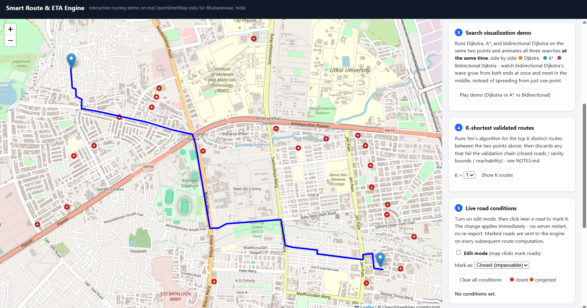
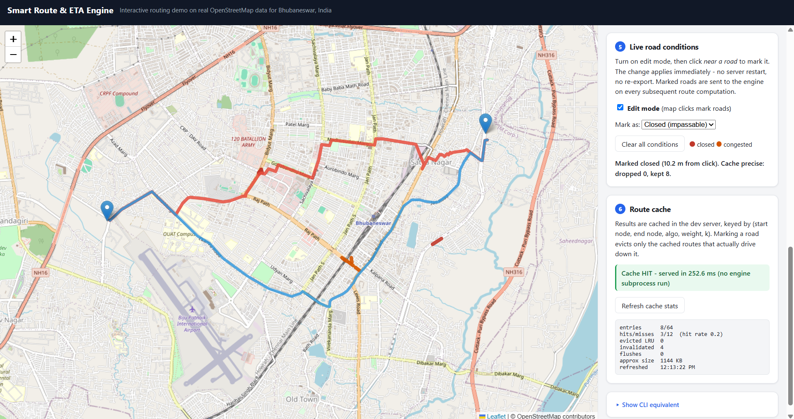
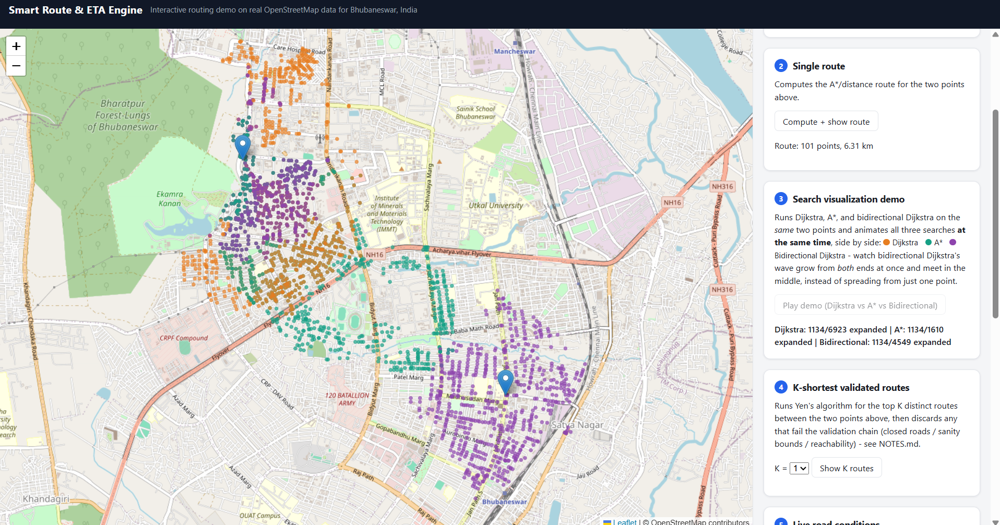
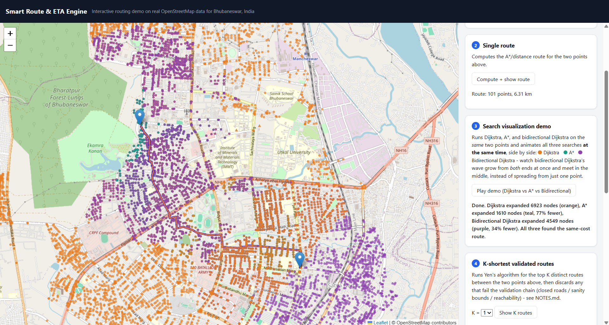

# Smart Route & ETA Engine

Interactive routing engine over real OpenStreetMap data for Bhubaneswar, India — Dijkstra, A*, bidirectional Dijkstra, and Yen's k-shortest-paths in C++, fronted by a Python dev server and a Leaflet map. Routes can be weighted by distance or by a time-based ETA strategy, using OSM speed-limit tags where available.



*A route computed between two clicked points, drawn from the C++ engine's real output over the actual Bhubaneswar road graph (40,111 nodes, 98,211 directed edges).*

## Overview

The browser (Leaflet + vanilla JS, no framework) talks only to a single-threaded Python `dev_server.py`, which serves the static frontend and exposes `/compute`, `/compute_k`, `/conditions`, and `/cache/stats`. On each routing request it snaps the clicked lat/lon to a graph node itself, checks its own in-process LRU cache, and on a miss shells out to `route_engine.exe` as a one-shot subprocess — passing any live closed/congested edges — and reads back the JSON route it writes to disk. The split exists because the Python and C++ halves are genuinely separate toolchains that only need to agree on a file format (CSV in, JSON out): the C++ side stays a stateless, testable, one-shot computation engine, while all the mutable state (cache, live conditions, HTTP handling) lives in Python.

## Features

- **Three search algorithms** — Dijkstra, A*, and bidirectional Dijkstra, all verified to agree on the same-cost optimal route
- **K-shortest validated routes** — Yen's algorithm plus a chain-of-responsibility validation chain (closed roads / sanity bounds / reachability)
- **Live road conditions** — mark any road closed or congested from the map; applies immediately, no server restart or re-export
- **LRU route cache** — repeat queries skip the engine subprocess entirely; precise, edge-path-aware invalidation on road closures
- **Auto-reroute** — if a live condition change affects the currently displayed route, the frontend detects it (polling, every ~2.5s) and recomputes/redraws automatically, with an on-screen indicator that it happened automatically

## Live road conditions & route cache


*A road segment marked closed (red) forces the route to detour (blue) around it. The route cache panel on the right shows a cache **HIT served in 252.6 ms** — no engine subprocess run — versus a cold computation that has to re-run `route_engine.exe`.*

Marking a road doesn't flush the whole cache: only the cached routes that actually use that edge are evicted (precise, edge-path-membership invalidation). Re-opening a road is handled differently — a full flush — because relaxing a closure can make a previously-suboptimal route become optimal again, even if that route never touched the affected edge.

## Search algorithm comparison


*All three algorithms run **at the same time** on the same two points: orange = Dijkstra, teal = A*, purple = bidirectional Dijkstra. Watch bidirectional Dijkstra's wave grow from both ends and meet in the middle.*


*On this particular query: Dijkstra expanded 6,923 nodes, A* expanded 1,610 (77% fewer), and bidirectional Dijkstra expanded 4,549 (34% fewer) — all three still agreeing on the same-cost optimal route. Individual runs vary; see the averaged benchmark below for the reproducible numbers.*

### Real benchmark numbers

Averaged over 18 random source/target pairs (seed 42) on the full graph — see `benchmark_results.txt`:

| Weight strategy | A* vs Dijkstra (nodes expanded) | Bidirectional vs Dijkstra (nodes expanded) |
|---|---|---|
| distance | **74.3% fewer** | **18.0% fewer** |
| time | **53.3% fewer** | **24.9% fewer** |

Node-expansion counts are exact and the more reliable metric. Wall-clock timing is noisier — A* and bidirectional Dijkstra both pay real per-node overhead (a heuristic call; a second priority queue and a meeting check), so on this hardware/toolchain the wall-clock win is inconsistent and sometimes negative even when the node-count savings are large. Don't cite "faster" without qualifying it — the honest claim is "expands far fewer nodes; wall-clock benefit varies."

Cache hit vs miss speedup has genuinely varied between measurement sessions on this dev machine (~4x to ~9x for the same query and code, most likely due to background system load, not a regression) — treat any single multiplier as illustrative, not a fixed guarantee.

## Setup

Two things are generated locally and are **not** in the repo: `data/*.csv` and `cpp/build/`.

```
# 1. Generate the road network (hits Nominatim + Overpass, ~30-90s)
python scripts\export_osm.py

# 2. Build the C++ engine
cmake -S cpp -B cpp\build -G "MinGW Makefiles" -DCMAKE_CXX_COMPILER="C:\MinGW\bin\g++.exe" -DCMAKE_MAKE_PROGRAM="C:\MinGW\bin\mingw32-make.exe"
cmake --build cpp\build

# 3. Start the dev server
python scripts\dev_server.py

# 4. Open http://localhost:8765
```

### Changing the target city

Edit `PLACE_QUERY` in `scripts/export_osm.py` (e.g. `"Pune, India"`), then re-run step 1 and restart the dev server. Nothing else hardcodes Bhubaneswar — the city name is resolved to a bounding box via Nominatim at run time.

## Known limitations

- **Not production-deployed.** `route_engine.exe` is a Windows binary; the dev server is deliberately single-threaded (the cache and live-conditions store aren't lock-protected); there's no authentication, authorization, or HTTPS.
- **Traffic/closures are manually simulated**, not derived from live GPS or a real traffic feed — they're entered by clicking a road in "Edit mode."
- **~24% of graph nodes have real isolation gaps** (60–250 m to their nearest road-connected neighbor), because the OSM export filter excludes `highway=service` roads (internal/campus/parking roads). Two clicks in such an area can snap to the same node — this is now caught and reported clearly rather than producing a fake route, but the underlying graph-coverage gap itself isn't fixed.
- **Auto-reroute is polling-based** (~2.5s latency), not a WebSocket push, and only covers the single-route view (not the K-routes or algorithm-comparison views).
